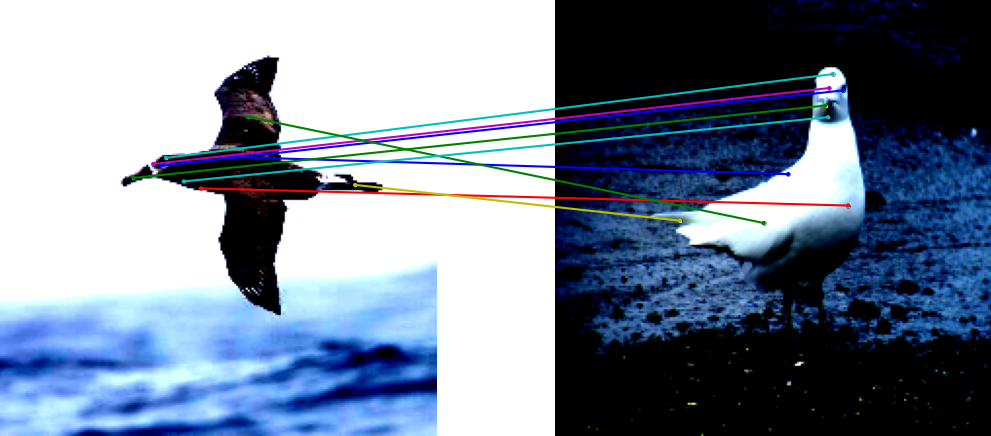
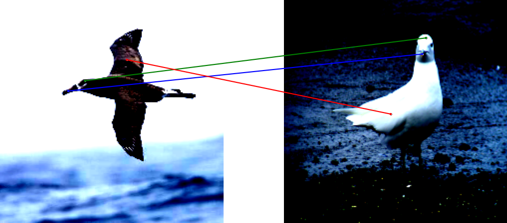
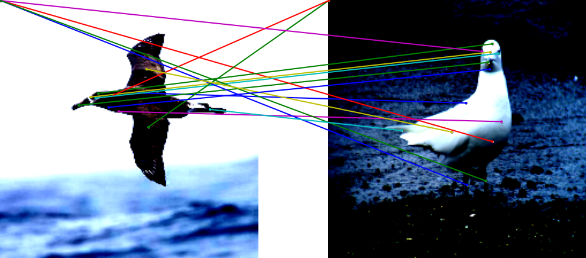

# dl_project
Венгерское внимание

Google drive with the dataset, embeddings and adjacency matrices https://drive.google.com/drive/folders/1csZ98jszqoT_-Qsme9b-26E1pxxqtvy2?usp=sharing

The directory preprocessing contains necessary notebooks for preprocessing the data (graphs, images).

Names of the notebooks roughly correspond to their purpose (train, baselines, model).

There are additional notebooks from the Superglue paper, which was modified in order to satisfy our settings. We included only modified notebooks, in order to run Superglue one should clone https://github.com/magicleap/SuperGluePretrainedNetwork and replace modified notebooks.

The resulting matches are illustrated here:

**Ground truth match**

As one can see Superglu match not all keypoints.
Lines from top left corner correspond to matches of parts of birds which are not present on the picture.

**Superglue**

Our results are much better
**With attention**

**Without attention**

